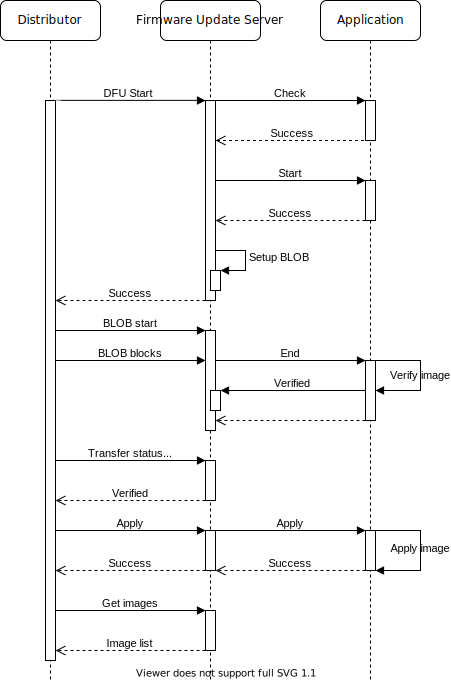

.. _bluetooth_mesh_dfu_srv:

Firmware Update Server
######################

<<<<<<< HEAD
The Firmware Update Server model implements the Target node functionality of the :ref:`bluetooth_mesh_dfu` subsystem. It extends the :ref:`bluetooth_mesh_blob_srv`, which it uses to receive the firmware image binary from the Distributor node.

Together with the extended BLOB Transfer Server model, the Firmware Update Server model implements all the required functionality for receiving firmware updates over the mesh network, but does not provide any functionality for storing, applying or verifying the images.
=======
The Firmware Update Server model implements the Target node functionality of the
:ref:`bluetooth_mesh_dfu` subsystem. It extends the :ref:`bluetooth_mesh_blob_srv`, which it uses to
receive the firmware image binary from the Distributor node.

Together with the extended BLOB Transfer Server model, the Firmware Update Server model implements
all the required functionality for receiving firmware updates over the mesh network, but does not
provide any functionality for storing, applying or verifying the images.
>>>>>>> 01478ffa5f76283e4556b4b7585875d50d82484d

Firmware images
***************

<<<<<<< HEAD
The Firmware Update Server holds a list of all the updatable firmware images on the device. The full list shall be passed to the server through the ``_imgs`` parameter in :c:macro:`BT_MESH_DFU_SRV_INIT`, and must be populated before the Bluetooth mesh subsystem is started. Each firmware image in the image list must be independently updatable, and should have its own firmware ID.

For instance, a device with an upgradable bootloader, an application and a peripheral chip with firmware update capabilities could have three entries in the firmware image list, each with their own separate firmware ID.
=======
The Firmware Update Server holds a list of all the updatable firmware images on the device. The full
list shall be passed to the server through the ``_imgs`` parameter in
:c:macro:`BT_MESH_DFU_SRV_INIT`, and must be populated before the Bluetooth mesh subsystem is
started. Each firmware image in the image list must be independently updatable, and should have its
own firmware ID.

For instance, a device with an upgradable bootloader, an application and a peripheral chip with
firmware update capabilities could have three entries in the firmware image list, each with their
own separate firmware ID.
>>>>>>> 01478ffa5f76283e4556b4b7585875d50d82484d

Receiving transfers
*******************

<<<<<<< HEAD
The Firmware Update Server model uses a BLOB Transfer Server model on the same element to transfer the binary image. The interaction between the Firmware Update Server, BLOB Transfer Server and application is described below:
=======
The Firmware Update Server model uses a BLOB Transfer Server model on the same element to transfer
the binary image. The interaction between the Firmware Update Server, BLOB Transfer Server and
application is described below:
>>>>>>> 01478ffa5f76283e4556b4b7585875d50d82484d

   Bluetooth mesh Firmware Update Server transfer

Transfer check
==============

<<<<<<< HEAD
The transfer check is an optional pre-transfer check the application can perform on incoming firmware image metadata. The Firmware Update Server performs the transfer check by calling the :c:member:`check <bt_mesh_dfu_srv_cb.check>` callback.

The result of the transfer check is a pass/fail status return and the expected :c:type:`bt_mesh_dfu_effect`. The DFU effect return parameter will be communicated back to the Distributor, and should indicate what effect the firmware update will have on the mesh state of the device. If the transfer will cause the device to change its Composition Data or become unprovisioned, this should be communicated through the effect parameter of the metadata check.
=======
The transfer check is an optional pre-transfer check the application can perform on incoming
firmware image metadata. The Firmware Update Server performs the transfer check by calling the
:c:member:`check <bt_mesh_dfu_srv_cb.check>` callback.

The result of the transfer check is a pass/fail status return and the expected
:c:type:`bt_mesh_dfu_effect`. The DFU effect return parameter will be communicated back to the
Distributor, and should indicate what effect the firmware update will have on the mesh state of the
device. If the transfer will cause the device to change its Composition Data or become
unprovisioned, this should be communicated through the effect parameter of the metadata check.
>>>>>>> 01478ffa5f76283e4556b4b7585875d50d82484d

Start
=====

<<<<<<< HEAD
The Start procedure prepares the application for the incoming transfer. It'll contain information about which image is being updated, as well as the update metadata.

The Firmware Update Server :c:member:`start <bt_mesh_dfu_srv_cb.start>` callback must return a pointer to the BLOB Writer the BLOB Transfer Server will send the BLOB to.
=======
The Start procedure prepares the application for the incoming transfer. It'll contain information
about which image is being updated, as well as the update metadata.

The Firmware Update Server :c:member:`start <bt_mesh_dfu_srv_cb.start>` callback must return a
pointer to the BLOB Writer the BLOB Transfer Server will send the BLOB to.
>>>>>>> 01478ffa5f76283e4556b4b7585875d50d82484d

BLOB transfer
=============

<<<<<<< HEAD
After the setup stage, the Firmware Update Server prepares the BLOB Transfer Server for the incoming transfer. The entire firmware image is transferred to the BLOB Transfer Server, which passes the image to its assigned BLOB Writer.

At the end of the BLOB transfer, the Firmware Update Server calls its :c:member:`end <bt_mesh_dfu_srv_cb.end>` callback.
=======
After the setup stage, the Firmware Update Server prepares the BLOB Transfer Server for the incoming
transfer. The entire firmware image is transferred to the BLOB Transfer Server, which passes the
image to its assigned BLOB Writer.

At the end of the BLOB transfer, the Firmware Update Server calls its
:c:member:`end <bt_mesh_dfu_srv_cb.end>` callback.
>>>>>>> 01478ffa5f76283e4556b4b7585875d50d82484d

Image verification
==================

<<<<<<< HEAD
After the BLOB transfer has finished, the application should verify the image in any way it can to ensure that it is ready for being applied.
Once the image has been verified, the application calls :c:func:`bt_mesh_dfu_srv_verified`.
=======
After the BLOB transfer has finished, the application should verify the image in any way it can to
ensure that it is ready for being applied.  Once the image has been verified, the application calls
:c:func:`bt_mesh_dfu_srv_verified`.
>>>>>>> 01478ffa5f76283e4556b4b7585875d50d82484d

If the image can't be verified, the application calls :c:func:`bt_mesh_dfu_srv_rejected`.

Applying the image
==================

<<<<<<< HEAD
Finally, if the image was verified, the Distributor may instruct the Firmware Update Server to apply the transfer. This is communicated to the application through the :c:member:`apply <bt_mesh_dfu_srv_cb.apply>` callback. The application should swap the image and start running with the new firmware. The firmware image table should be updated to reflect the new firmware ID of the updated image.

When the transfer applies to the mesh application itself, the device might have to reboot as part of the swap. This restart can be performed from inside the apply callback, or done asynchronously. After booting up with the new firmware, the firmware image table should be updated before the Bluetooth mesh subsystem is started.

The Distributor will read out the firmware image table to confirm that the transfer was successfully applied. If the metadata check indicated that the device would become unprovisioned, the Target node is not required to respond to this check.
=======
Finally, if the image was verified, the Distributor may instruct the Firmware Update Server to apply
the transfer. This is communicated to the application through the :c:member:`apply
<bt_mesh_dfu_srv_cb.apply>` callback. The application should swap the image and start running with
the new firmware. The firmware image table should be updated to reflect the new firmware ID of the
updated image.

When the transfer applies to the mesh application itself, the device might have to reboot as part of
the swap. This restart can be performed from inside the apply callback, or done asynchronously.
After booting up with the new firmware, the firmware image table should be updated before the
Bluetooth mesh subsystem is started.

The Distributor will read out the firmware image table to confirm that the transfer was successfully
applied. If the metadata check indicated that the device would become unprovisioned, the Target node
is not required to respond to this check.
>>>>>>> 01478ffa5f76283e4556b4b7585875d50d82484d

API reference
*************

.. doxygengroup:: bt_mesh_dfu_srv
   :project: Zephyr
   :members:
